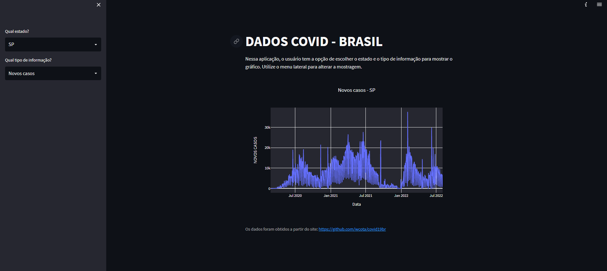

# Compartilhando Gráficos Interativos da Covid-19 com Python

Projeto - Live Coding da  Digital Innovation One<br>

Aplicação online com dados da Covid-19 apenas utilizando Python com bibliotecas open-source e plataformas gratuitas.<br>
Instrutora: Mariane Neiva

#### Tecnologias usadas:
```
python
streamlit
plotly
pandas
```
#### Aplicação rodando

